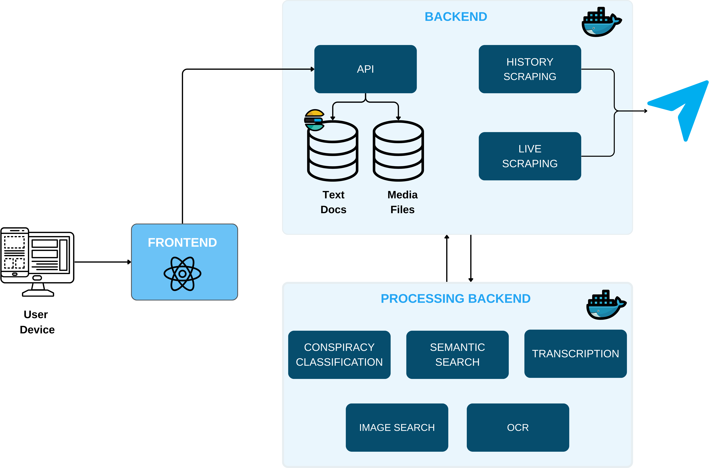

# Teledash Backend

_Research and analysis software for Telegram_

## About Teledash

Teledash is an open-source software for monitoring and analyzing anti-democratic content on Telegram channels and groups. 

**How it works:** Teledash uses Telegram client accounts (phone numbers with API credentials) that join public channels and groups to collect data. Each phone number acts as a regular Telegram user account that can access and scrape content from the channels it joins. For more details, see [How Teledash Works](#how-teledash-works) and [Obtaining API credentials](#obtaining-api-credentials-from-telegram).

It enables researchers and analysts to:

- **Collect data** from public Telegram channels using multiple client accounts
- **Store and index** messages, media, and metadata in Elasticsearch
- **Configure data collection** flexibly (time spans, attachment types, update intervals, attachment storage duration)
- **Search** content using lexical and semantic search in texts and images
- **Analyze** content using tags, saved searches, metrics
- **Monitor** channels in real-time with live scraping capabilities
- **Classify** content using ML models (e.g., conspiracy detection)
- **Explore data** through an integrated web interface

## Architecture

Teledash consists of three separate repositories:

- [Frontend](https://github.com/ARAI-Telegram/teledash-frontend)** - Web interface
- Backend (this repository) - Core API and worker services for data collection and management
- [Processing Backend](https://github.com/ARAI-Telegram/teledash-backend-processing)(optional) - ML-powered services (semantic search, transcription, classification)

**Minimum setup:** Frontend + Backend. The Processing Backend is entirely optional, and individual services within it can be enabled or disabled independently.

All components run in Docker containers. The backend uses Celery for task orchestration (scraping, processing), Elasticsearch for storing text data and metadata, and S3-compatible object storage for media files (see [Object Storage Setup](#object-storage-setup)).



## Configuration

### How Configuration Works

Teledash uses a three-tier configuration system:

1. **`common/settings.py`** - Contains default values for all Python application settings. **Do not edit this file.**
2. **`.env.example`** - Template showing all available configuration options.
3. **`.env`** - Your local configuration file. Values here override defaults in `settings.py`. The file is not part of the repository, instead can be created by copying the template `.env.example`, see below.

### Setup Instructions

1. Copy `.env.example` to `.env`:
   ```bash
   cp .env.example .env
   ```

2. **Required**: Fill in the following values (no defaults provided):
   - `STORAGE_ACCESS_KEY` - Your storage provider access key
   - `STORAGE_SECRET_KEY` - Your storage provider secret key
   - `JWT_SECRET` - Secret key for JWT token generation

3. **Docker Compose Variables**: These are already uncommented in `.env.example` with defaults because Docker Compose services (like Kibana, Flower, worker containers) read them directly from `.env`:
   - `COMPOSE_PROJECT_NAME`, `ES_HOST`, `ES_PORT`, `ES_SCHEME` - Keep defaults or modify as needed
   - `LIVE_CONCURRENCY` - Keep default (1) or adjust based on number of Telegram accounts
   - `FLOWER_USER` and `FLOWER_PASSWORD` - Leave empty unless you want to use Flower monitoring

4. **Python Settings (Optional)**: Uncomment any settings in the bottom section of `.env` to override their defaults in `settings.py`

### Configuration Reference

Complete list of all configuration variables. Python application settings have defaults in `common/settings.py`. Docker Compose variables are set in `.env.example`. Variables marked as **"Required"** have no defaults and must be configured.

| Name                            | Description                                                                                                                                                                                                   | Default Value                                      |
| ------------------------------- | ------------------------------------------------------------------------------------------------------------------------------------------------------------------------------------------------------------- | -------------------------------------------------- |
| **Storage (Required)**          |                                                                                                                                                                                                               |                                                    |
| `STORAGE_ACCESS_KEY`            | API username/access key for object storage                                                                                                                                                                    | **Required - No default**                          |
| `STORAGE_SECRET_KEY`            | API secret key for object storage                                                                                                                                                                             | **Required - No default**                          |
| **Authentication (Required)**   |                                                                                                                                                                                                               |                                                    |
| `JWT_SECRET`                    | Secret key for JWT token generation                                                                                                                                                                           | **Required - No default**                          |
| **Monitoring (Optional)**       |                                                                                                                                                                                                               |                                                    |
| `FLOWER_USER`                   | Username to access [Flower](https://flower.readthedocs.io/) monitoring interface (only needed if using Flower)                                                                                                | Optional - No default                              |
| `FLOWER_PASSWORD`               | Password to access Flower monitoring interface (only needed if using Flower)                                                                                                                                  | Optional - No default                              |
| **Project**                     |                                                                                                                                                                                                               |                                                    |
| `COMPOSE_PROJECT_NAME`          | Docker Compose project name                                                                                                                                                                                   | `"teledash"`                                       |
| **Telegram API**                |                                                                                                                                                                                                               |                                                    |
| `TELEGRAM_TEST_MODE`            | Whether [Telegram test environment](https://docs.pyrogram.org/topics/test-servers) should be used (during authentication)                                                                                     | `FALSE`                                            |
| **Elasticsearch**               |                                                                                                                                                                                                               |                                                    |
| `ES_HOST`                       | Hostname for Elasticsearch                                                                                                                                                                                    | `"elastic"` (Docker container name)                |
| `ES_PORT`                       | Port for Elasticsearch                                                                                                                                                                                        | `9200`                                             |
| `ES_SCHEME`                     | Scheme for Elasticsearch (http/https)                                                                                                                                                                         | `"http"`                                           |
| **Storage Provider**            |                                                                                                                                                                                                               |                                                    |
| `STORAGE_PROVIDER`              | Storage provider type. Options: `"aws"`, `"s3-compatible"`                                                                                                                                                    | `"s3-compatible"`                                  |
| `STORAGE_REGION`                | Storage region (required for AWS provider)                                                                                                                                                                    | `None`                                             |
| `STORAGE_USE_SSL`               | Enable HTTPS for storage connections                                                                                                                                                                          | `FALSE`                                            |
| `STORAGE_ENDPOINT`              | Endpoint for S3-compatible storage (e.g., MinIO)                                                                                                                                                              | `"minio:9000"`                                     |
| `STORAGE_BUCKET_PREFIX`         | Optional prefix for bucket names (e.g., `"myapp-"` creates `"myapp-photos"`, `"myapp-videos"`)                                                                                                                | `""` (no prefix)                                   |
| **Flower Monitoring**           |                                                                                                                                                                                                               |                                                    |
| `FLOWER_HOST`                   | Hostname for Flower                                                                                                                                                                                           | `"flower"` (Docker container name)                 |
| `FLOWER_PORT`                   | Port for Flower                                                                                                                                                                                               | `5555`                                             |
| **Scraping**                    |                                                                                                                                                                                                               |                                                    |
| `SCRAPE_CHATS_MAX_DAYS`         | Number of days to scrape backwards when scraping for the first time. Set to `0` to scrape all content. **Warning**: Scraping all content can take several days                                                | `7`                                                |
| `SCRAPE_CHATS_INTERVAL_MINUTES` | Interval in minutes at which history and live scraping is triggered                                                                                                                                           | `30`                                               |
| `SCRAPE_USERS`                  | Whether to scrape and store user profiles in the users index. If `FALSE`, user references are kept in messages but users are not stored separately                                                            | `FALSE`                                            |
| **Attachments**                 |                                                                                                                                                                                                               |                                                    |
| `SAVE_ATTACHMENTS`              | Whether to download attachments (types specified in `SAVE_ATTACHMENT_TYPES`)                                                                                                                                  | `TRUE`                                             |
| `SAVE_ATTACHMENT_TYPES`         | Attachment types to download if `SAVE_ATTACHMENTS` is `TRUE`                                                                                                                                                  | `["animation", "audio", "document", "photo", "sticker", "video", "video_note", "voice", "web_page"]` |
| `KEEP_ATTACHMENT_FILES_DAYS`    | Number of days after which attachments will be automatically deleted. Set to `0` to keep files indefinitely                                                                                                   | `0` (keep forever)                                 |
| **Live Scraping**               |                                                                                                                                                                                                               |                                                    |
| `LIVE_UPDATES`                  | Whether live scraping of messages should be active                                                                                                                                                            | `FALSE`                                            |
| `LIVE_CONCURRENCY`              | Number of concurrent live scraping workers. **Must be >= number of active Telegram accounts used for scraping**                                                                                               | `1`                                                |
| `LIVE_DELETIONS`                | How to handle message deletions during live scraping. Options: `"ignore"`, `"mark"`, `"delete"`                                                                                                               | `"mark"`                                           |
| **Authentication**              |                                                                                                                                                                                                               |                                                    |
| `JWT_LIFETIME_SECONDS`          | Lifetime of JWT tokens in seconds                                                                                                                                                                             | `3600` (1 hour)                                    |
| **Language Detection**          |                                                                                                                                                                                                               |                                                    |
| `FALLBACK_LANGUAGE`             | Fallback [language code (ISO 639-1)](https://en.wikipedia.org/wiki/List_of_ISO_639-1_codes) for Elasticsearch analyzers if chat language can't be detected automatically                                      | `"en"`                                             |
| **API**                         |                                                                                                                                                                                                               |                                                    |
| `API_ALLOW_ORIGINS`             | CORS origins - domains allowed to access the API                                                                                                                                                              | `["http://localhost:3000"]`                        |
| **Semantic Search**             |                                                                                                                                                                                                               |                                                    |
| `SEMANTIC_TEXT_SEARCH_API`      | URL of the text semantic search API endpoint                                                                                                                                                                  | `"http://text-search-api:8001/search"`             |
| `SEMANTIC_IMAGE_SEARCH_API`     | URL of the image semantic search API endpoint                                                                                                                                                                 | `"http://image-search-api:8002/search"`            |

_Note: Scraping for the first time can take several hours to days to download and process all content depending on the configuration settings, available ressources and number of telegram clients used._

---

## Requirements

- S3-compatible Object Storage (AWS S3, Hetzner, MinIO, Cloudflare R2, etc.)
- [Docker](https://docs.docker.com/get-docker/)

## Deployment

1. **Set up object storage** (see Object Storage Setup section below)
2. **Configure environment**: Follow the [Configuration Setup Instructions](#setup-instructions) above to create and configure your `.env` file
3. **Deploy**: Run `docker-compose up --build`

**🔒 SECURITY WARNING:** The application comes with default admin credentials:
- Username: `admin@example.com`
- Password: `12345678`

**You MUST change these immediately after first login!** These default credentials are publicly known and pose a **serious security risk** if left unchanged.

**Please note: When scraping history for the first time with a new Telegram account, manual approval inside the Telegram client of choice (e.g. Smartphone, Desktop version) is required. Historical data cannot be fetched until approval is given.**

### Monitoring and Debugging Tools (Optional)

For security reasons, monitoring tools are **disabled by default** in production (`docker-compose.yml`). They are enabled in the development setup (`docker-compose.debug.yml`).

**To enable monitoring in production:**

1. **Flower (Celery Task Monitor)**: Uncomment the `flower` service in `docker-compose.yml`
   - Set `FLOWER_USER` and `FLOWER_PASSWORD` in `.env`
   - Access at: http://localhost:5555
   - Provides real-time monitoring of Celery workers and tasks

2. **Kibana (Elasticsearch UI)**: Uncomment the `kibana` service in `docker-compose.yml`
   - Access at: http://localhost:5601
   - Provides data exploration, visualization, and Elasticsearch management

⚠️ **Security Warning**: Only enable these services when needed and ensure they are not exposed to the public internet without proper authentication and firewall rules.

---

### Object Storage Setup

Teledash supports multiple S3-compatible storage providers. Choose one based on your needs:

#### Option 1: MinIO (Development/Self-hosted)

**For development with Docker:**

```bash
# Run MinIO in a separate container with Docker volume
docker run -d \
  --name minio \
  -p 9000:9000 \
  -p 9001:9001 \
  -v minio-dev-data:/data \
  -e "MINIO_ROOT_USER=${STORAGE_ACCESS_KEY}" \
  -e "MINIO_ROOT_PASSWORD=${STORAGE_SECRET_KEY}" \
  quay.io/minio/minio server /data --console-address ":9001"

# If Teledash runs on the same machine, connect MinIO to its Docker network.
# Lets Teledash access MinIO via its container name (minio:9000, the default endpoint).
# Skip this if MinIO runs on another machine—set STORAGE_ENDPOINT to its URL instead.
docker network connect teledash_default minio

```

**Environment configuration:**

```env
STORAGE_PROVIDER=s3-compatible
STORAGE_USE_SSL=false
STORAGE_ENDPOINT=minio:9000
STORAGE_ACCESS_KEY=your_access_key
STORAGE_SECRET_KEY=your_secret_key
```

**Access MinIO Console:** http://localhost:9001

#### Option 2: AWS S3

```env
STORAGE_PROVIDER=aws
STORAGE_REGION=us-east-1
STORAGE_USE_SSL=true
STORAGE_ACCESS_KEY=your_aws_access_key
STORAGE_SECRET_KEY=your_aws_secret_key
```

#### Option 3: Hetzner Object Storage

```env
STORAGE_PROVIDER=aws
STORAGE_REGION=eu-central-1
STORAGE_USE_SSL=true
STORAGE_ENDPOINT=fsn1.your-objectstorage.com
STORAGE_ACCESS_KEY=your_hetzner_access_key
STORAGE_SECRET_KEY=your_hetzner_secret_key
```

#### Option 4: Cloudflare R2

```env
STORAGE_PROVIDER=s3-compatible
STORAGE_USE_SSL=true
STORAGE_ENDPOINT=account-id.r2.cloudflarestorage.com
STORAGE_ACCESS_KEY=your_r2_access_key
STORAGE_SECRET_KEY=your_r2_secret_key
```

---

### Processing Backend Setup (Optional)

Teledash can be extended with a separate **Processing Backend** for ML-powered features. This is **optional** – the core backend works without it, but you'll miss out on advanced features.

The Processing Backend provides:
- **Semantic search**: Text and image search using vector embeddings
- **Audio transcription**: ASR (Automatic Speech Recognition) for audio files
- **Text classification**: Conspiracy detection by default, customizable for other topics
- **Data labeling**: Interface for labeling data to retrain classification models (coming soon)

If you choose not to use the Processing Backend, these features will simply be unavailable.

For detailed Processing Backend setup instructions, see the Processing [Backend Repository](https://github.com/ARAI-Telegram/teledash-backend-processing).

#### Same Machine Deployment

If both backends run on the same machine using Docker Compose, they can share a Docker network:

```bash
# The backends will automatically communicate via container names
# Default endpoints work out of the box:
# - SEMANTIC_TEXT_SEARCH_API=http://text-search-api:8001/search
# - SEMANTIC_IMAGE_SEARCH_API=http://image-search-api:8002/search
```

No additional configuration needed if using the default setup.

#### Different Machine Deployment

If the Processing Backend runs on a **different machine**, you must:

1. **Update `.env`** with the actual URLs of the processing services:
   ```env
   SEMANTIC_TEXT_SEARCH_API=http://<processing-server-ip>:8001/search
   SEMANTIC_IMAGE_SEARCH_API=http://<processing-server-ip>:8002/search
   ```

2. **Ensure network accessibility**: The Teledash backend must be able to reach the processing server's ports (8001, 8002)

3. **Configure firewalls** if necessary to allow communication between the machines

**Note:** When backends are on different machines, they cannot share a Docker network. Make sure the processing services are accessible via their public/internal IPs.

## Development

We use [VS Code Remote-Containers](https://code.visualstudio.com/docs/remote/containers) for the development setup. To start developing in a Docker container, run the **Remote-Containers: Open Folder in Container**-Command from the Command Palette and select the _worker_ or _api_-folder.

**Note:** The development setup uses `docker-compose.debug.yml` for debugging, while production deployment uses `docker-compose.yml`. The debug configuration includes volume mounts for live code reloading and keeps containers running for interactive development.

### API

#### Starting the API

Start the API via the **Run and Debug** panel in VS Code, or from the terminal:

```shell
$ uvicorn api.main:app --reload
```

#### Endpoints

Once the API is up and running you can open the interactive documentation of the API at [http://127.0.0.1:8000/docs](http://127.0.0.1:8000/docs).

#### Default user

See the [Deployment](#deployment) section for default admin credentials and the security warning about changing them immediately.

### Worker

Start Celery in the **Run and Debug** panel in VS Code. Use the Celery workers task to launch all scraping workers, or select individual workers as needed.

To test a task, you can run the following in a Python shell, for example:

```python
>>> from worker.tasks import init_scrapers
>>> init_scrapers.delay()
```

Or, for most workers, there is also a script to trigger task execution. These files are named something like `trigger_scraping_task.py` and can be run with:

```shell
python trigger_scraping_task.py
```

Some workers support the `--clear` flag at the end of the command. This removes task-specific database entries or fields to start from scratch. For example:

```shell
python trigger_scraping_task.py --clear
```

This will first delete all previously scraped messages and chat information before calling the `init_scrapers` task.
**Be careful: this will also delete any data scraped in production!**

See also the note above in the Deployment section regarding **manual approval** necessary for new Telegram accounts.

### Running Tests

#### Installing Test Dependencies

First, install test dependencies inside the Docker container:

```shell
# For API container (can run both common and API tests)
docker exec api pip install -r common/requirements.test.txt

# For worker container (can run common tests)
docker exec worker pip install -r common/requirements.test.txt
```

#### Running All Tests

**In API container** (runs both common and API tests):

```shell
# Run all tests
python3 -m pytest tests/ common/tests/ -v

# Or run specific test suites
python3 -m pytest common/tests/ -v  # Common module tests
python3 -m pytest tests/ -v         # API tests only
```

**In worker container** (runs only common tests):

```shell
python3 -m pytest common/tests/ -v
```

#### Running Specific Test Types

```shell
# Run only unit tests (fast, no external dependencies)
python3 -m pytest tests/unit/ -v

# Run only integration tests (requires Elasticsearch)
python3 -m pytest tests/integration/ -v
```

For more detailed information about testing patterns, fixtures, and best practices, see the [API tests README](tests/README.md).

### Useful Docker commands

#### Open a shell inside container:

```shell
$ docker exec -it <container id or name> /bin/bash
```

As root:

```shell
$ docker exec -it --user root <container id or name> /bin/bash
```

## How Teledash Works

Teledash uses the Telegram API via the Pyrogram library.
Users can create so-called `clients` (Telegram accounts) by providing a phone number, API hash, and API ID.
These clients join public channels and groups to collect messages, user profiles (if available), and attachments like images or videos, depending on the configuration.

Teledash can fetch **historical data** (with configurable time range and frequency) and **live data** (which can be disabled).
At scheduled intervals, chat information is updated, new users are stored, and media files can be automatically deleted after a defined time.
A history scraper also runs at configurable intervals and can activate the live client if needed.

Collected data is stored in an Elasticsearch database.
The data model includes, for example:

    Clients: all configured clients and their associated chats

    Chats: chat metadata (title, description, type, member count, etc.)

    Users: users from channels

    Messages: one index per chat, plus an optional additional index with vectorized messages for semantic search.

    Metrics: such as member count, message posts, and message views

All processing of the data happens locally (no external services are involved):

    Language detection (gcld3)

    Full-text and image indexing with custom analyzers

    Embedding generation for semantic search (using vector indices)

    Conspiracy classification with a fine-tuned transformer model

    Transcription with Whisper

The language model components are part of a separate **Processing Backend Repository**.

Teledash also provides admin and user accounts, which require authentication via username and password.

## Other Notes

### Obtaining API credentials from Telegram

Before you can start scraping, you need to register at least one Telegram client account. Each client requires:

1. **Phone number** - A valid phone number that can receive SMS/calls from Telegram
2. **API credentials** - Obtained from Telegram by [registering an application](https://core.telegram.org/api/obtaining_api_id#obtaining-api-id)
   - `api_id` - Unique identifier for your application
   - `api_hash` - Secret key for your application

These credentials allow Teledash to authenticate as a Telegram client using your phone number. You can register multiple clients with different phone numbers to increase scraping capacity.

---

## Citation

If you use Teledash in your research, please cite: 

```bibtex
@software{teledash2025,
author = {{Pustet, Milena and Illies, Yannis and Stanjek, Grischa and Mihaljević, Helena and Gregor, Weichbrodt}},
title = {{Teledash}},
url = {https://github.com/ARAI-Telegram/teledash-backend},
version = {0.1.0},
}

